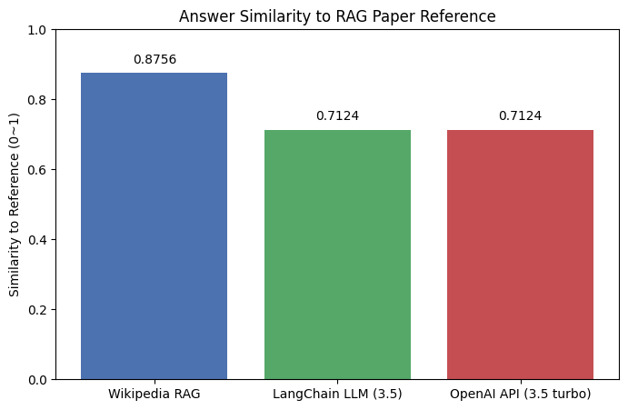

```python
"""
Pipeline Overview:
[User Input]
     ↓
[LangGraph to manage control flow]
     ↓
[1. Toolformer style tool selection]
     ↓
[2. Tavily for Web + Wikipedia search (or custom retriever)]
     ↓
[3. CRAG for summarization + QA generation (e.g., DistilBART + FLAN-T5)]
     ↓
[4. LangChain to connect the entire pipeline]
     ↓
[5. sklearn/evaluation for results evaluation and tuning]
     ↓
[Final response output]
"""
```


    '\nPipeline Overview:\n[User Input]\n     ↓\n[LangGraph to manage control flow]\n     ↓\n[1. Toolformer style tool selection]\n     ↓\n[2. Tavily for Web + Wikipedia search (or custom retriever)]\n     ↓\n[3. CRAG for summarization + QA generation (e.g., DistilBART + FLAN-T5)]\n     ↓\n[4. LangChain to connect the entire pipeline]\n     ↓\n[5. sklearn/evaluation for results evaluation and tuning]\n     ↓\n[Final response output]\n'


```python
from openai import OpenAI
import os
from dotenv import load_dotenv

load_dotenv()  # .env에서 환경변수 불러오기
client = OpenAI()  # OPENAI_API_KEY 환경변수 자동 인식
```


```python
#def chat_with_openai(messages):calls the OpenAI API and returns a response to the chat messages.
```


```python
def chat_with_openai(messages):
    """
    Sends a chat completion request to OpenAI API using the provided messages
    and returns the generated response content.

    Args:
        messages (list): A list of message dicts following OpenAI chat format,
                         e.g., [{"role": "user", "content": "Hello!"}, ...]

    Returns:
        str: The content of the assistant's reply or an error message if the API call fails.
    """
    try:
        # Call the OpenAI chat completion endpoint with the specified model and messages
        response = client.chat.completions.create(
            model="gpt-4o-mini",
            messages=messages,
            temperature=0  # deterministic response
        )
        # Extract and return the assistant's message content from the response
        return response.choices[0].message.content
    except Exception as e:
        # Return an error string if the API call raises an exception
        return f"[Error] OpenAI API call failed: {e}"

```


```python
#ain execution block: sets up system and user prompts, calls the chat function, and prints the GPT response.
```


```python
if __name__ == "__main__":
    system_prompt = {"role": "system", "content": "You are a helpful assistant."}
    user_prompt = {"role": "user", "content": "Explain natural language processing briefly."}

    messages = [system_prompt, user_prompt]

    answer = chat_with_openai(messages)
    print("GPT Response:\n", answer)

```

    GPT Response:
     Natural Language Processing (NLP) is a field of artificial intelligence that focuses on the interaction between computers and humans through natural language. The goal of NLP is to enable computers to understand, interpret, and generate human language in a way that is both meaningful and useful.
    
    NLP encompasses a variety of tasks, including:
    
    1. **Text Analysis**: Understanding and extracting information from text, such as sentiment analysis, topic modeling, and named entity recognition.
    2. **Language Generation**: Creating coherent and contextually relevant text, such as in chatbots or automated content generation.
    3. **Machine Translation**: Automatically translating text from one language to another.
    4. **Speech Recognition**: Converting spoken language into text.
    5. **Text-to-Speech**: Converting written text into spoken language.
    
    NLP combines techniques from linguistics, computer science, and machine learning to process and analyze large amounts of natural language data. It has applications in various domains, including customer service, healthcare, education, and more.


```python
"""
Toolformer-style Tool Selection
The LLM (e.g., GPT) autonomously decides which tool to use based on the context of the query.
It can automatically determine whether to call a search tool, summarization tool, external API, or other functions.
LangChain provides implementations such as the Multi-Tool Agent or Router Agent that facilitate this automatic tool routing.
In essence, the LLM intelligently chooses and invokes the appropriate tool (e.g., search_tool, math_tool) to handle the task.
This approach enables dynamic and context-aware tool usage, making interactions more flexible and efficient.
"""
```


    '\nToolformer-style Tool Selection\nThe LLM (e.g., GPT) autonomously decides which tool to use based on the context of the query.\nIt can automatically determine whether to call a search tool, summarization tool, external API, or other functions.\nLangChain provides implementations such as the Multi-Tool Agent or Router Agent that facilitate this automatic tool routing.\nIn essence, the LLM intelligently chooses and invokes the appropriate tool (e.g., search_tool, math_tool) to handle the task.\nThis approach enables dynamic and context-aware tool usage, making interactions more flexible and efficient.\n'


```python
# 2) Define tools
def search_tool(query: str) -> str:
    # Simulate a search result for the given query (not an actual search)
    return f"[SearchResult] Search results for '{query}'. (Not a real search)"

from asteval import Interpreter

aeval = Interpreter()

def math_tool(expression: str) -> str:
    try:
        # Evaluate the mathematical expression safely
        result = aeval(expression)
        if aeval.error:
            # Collect error messages if any evaluation errors occurred
            errors = "; ".join(str(err.get_error()) for err in aeval.error)
            aeval.error = []  # Reset errors after collecting
            return f"[MathError] Expression error: {errors}"
        return f"[MathResult] {expression} = {result}"
    except Exception as e:
        # Handle any exceptions raised during evaluation
        return f"[MathError] Exception occurred: {str(e)}"

```


```python
# Mapping tool names to their corresponding functions
TOOLS = {
    "search": {
        "description": "Information retrieval tool (example implementation)",
        "function": search_tool,
    },
    "math": {
        "description": "Safe mathematical calculation tool",
        "function": math_tool,
    },
}
```


```python
# test
```


```python
if __name__ == "__main__":
    # Test search_tool
    search_query = "OpenAI GPT models"
    search_result = TOOLS["search"]["function"](search_query)
    print(f"Search Tool Output:\n{search_result}\n")

    # Test math_tool
    math_expression = "2 + 3 * (4 - 1)"
    math_result = TOOLS["math"]["function"](math_expression)
    print(f"Math Tool Output:\n{math_result}\n")

    # Test math_tool with an invalid expression
    invalid_expression = "2 + * 3"
    error_result = TOOLS["math"]["function"](invalid_expression)
    print(f"Math Tool Error Output:\n{error_result}\n")

```

    Search Tool Output:
    [SearchResult] Search results for 'OpenAI GPT models'. (Not a real search)
    
    Math Tool Output:
    [MathResult] 2 + 3 * (4 - 1) = 11
    
    Math Tool Error Output:
    [MathError] Expression error: ('SyntaxError', '2 + * 3\nSyntaxError: invalid syntax (<unknown>, line 1)')
    


    2 + * 3
    SyntaxError: invalid syntax (<unknown>, line 1)


```python
def decide_tool(user_input: str) -> str:
    """
    Decide which tool to use based on the user's input by prompting the AI model.
    Returns the tool name and argument in 'tool_name: argument' format,
    or error messages if the format or tool is invalid.
    """
    prompt = f"""
You are a smart tool selector.
User question: "{user_input}"

Available tools: search, math

Output the tool to use and its argument in the form 'tool_name: argument'.
Example) search: latest AI news
""".strip()

    # Call the OpenAI chat completion endpoint with a system and user message
    response = client.chat.completions.create(
        model="gpt-4o-mini",
        messages=[
            {"role": "system", "content": "You are an AI deciding which tool to use."},
            {"role": "user", "content": prompt},
        ],
        temperature=0,
    )
    result = response.choices[0].message.content.strip()

    # Check if the result contains ':' to separate tool and argument
    if ":" not in result:
        return "[Error] Tool selection format is incorrect."

    # Parse the tool name and argument, stripping whitespace
    tool_name, argument = map(str.strip, result.split(":", 1))

    # Validate tool name against supported tools
    if tool_name not in TOOLS:
        return f"[Error] Tool '{tool_name}' is not supported."

    # Validate argument is not empty
    if not argument:
        return "[Error] Tool argument is empty."

    # Return the formatted tool name and argument
    return f"{tool_name}: {argument}"

```


```python
test_inputs = [
    "Calculate 2 + 3 * 4",
    "Find the latest news about AI",
    "What is 5 / 0?",
    "Tell me about LangChain"
]

for user_input in test_inputs:
    decision = decide_tool(user_input)
    print(f"Input: {user_input}\nDecided tool: {decision}\n")

```

    Input: Calculate 2 + 3 * 4
    Decided tool: math: 2 + 3 * 4
    
    Input: Find the latest news about AI
    Decided tool: search: latest news about AI
    
    Input: What is 5 / 0?
    Decided tool: math: 5 / 0
    
    Input: Tell me about LangChain
    Decided tool: search: LangChain overview and features
    


```python
#def run_tool_agent(tool_command: str) -> str:
"""
    Parses the tool command string, validates the tool name and argument,
    executes the corresponding tool function, and returns the result.
    If errors occur, returns a standardized JSON-formatted error message.
"""
```


    '\n    Parses the tool command string, validates the tool name and argument,\n    executes the corresponding tool function, and returns the result.\n    If errors occur, returns a standardized JSON-formatted error message.\n'


```python
def run_tool_agent(tool_command: str) -> str:
    # Check if the input command contains ':' to separate tool and argument
    if ":" not in tool_command:
        return "Input format error. Example: 'search: AI trends'"

    # Split the input into tool name and argument
    tool_name, argument = tool_command.split(":", 1)
    # Normalize tool name to lowercase to avoid case sensitivity issues
    tool_name = tool_name.strip().lower()
    # Remove any extra whitespace from argument
    argument = argument.strip()

    # Verify if the tool name exists in the supported tools dictionary
    if tool_name not in TOOLS:
        return f"[Error] Unsupported tool: {tool_name}"

    try:
        # Execute the function associated with the selected tool using the argument
        result = TOOLS[tool_name]["function"](argument)
        # Return the function's result
        return result
    except Exception as e:
        # If an error occurs, prepare a standardized JSON-formatted error message
        error_msg = {
            "error": "Tool execution error",
            "tool": tool_name,
            "message": str(e),
        }
        import json
        # Return the error message as a JSON string, preserving non-ASCII characters
        return json.dumps(error_msg, ensure_ascii=False)

```


```python
# Test cases for run_tool_agent function

test_commands = [
    "search: Latest AI news",
    "math: 2 + 3 * 4",
    "math: 5 / 0",               # Division by zero to test error handling
    "unknown: some argument",    # Unsupported tool test
    "search",                   # Invalid format test (missing ':')
    "math: ",                   # Empty argument test
]

for command in test_commands:
    print(f"Command: {command}")
    output = run_tool_agent(command)
    print(f"Output: {output}\n")

```

    Command: search: Latest AI news
    Output: [SearchResult] Search results for 'Latest AI news'. (Not a real search)
    
    Command: math: 2 + 3 * 4
    Output: [MathResult] 2 + 3 * 4 = 14
    
    Command: math: 5 / 0
    Output: [MathError] Expression error: ('ZeroDivisionError', '5 / 0\nZeroDivisionError: division by zero')
    
    Command: unknown: some argument
    Output: [Error] Unsupported tool: unknown
    
    Command: search
    Output: Input format error. Example: 'search: AI trends'
    
    Command: math: 
    Output: [MathResult]  = None
    


```python
def generate_final_response(user_input: str, tool_result: str) -> str:
    """
    Generate a friendly and easy-to-understand final response based on the user's input and the tool execution result.

    Args:
        user_input (str): The original question or input from the user.
        tool_result (str): The output or result returned from the selected tool.

    Returns:
        str: A polished, user-friendly response generated by the AI.
    """
    prompt = f"""
User question: "{user_input}"
Tool execution result: "{tool_result}"

Based on the above, please provide a kind and easy-to-understand answer.
"""
    try:
        # Call OpenAI's chat completion endpoint with system and user messages
        response = client.chat.completions.create(
            model="gpt-4o-mini",
            messages=[
                {"role": "system", "content": "You are a helpful assistant."},
                {"role": "user", "content": prompt},
            ],
            temperature=0,
        )
        # Return the AI-generated final response, stripped of extra whitespace
        return response.choices[0].message.content.strip()
    except Exception as e:
        # Return error message if API call fails
        return f"[Error] Failed to generate final response: {e}"


```


```python
if __name__ == "__main__":
    test_user_input = "What is 2 + 2?"
    test_tool_result = "2 + 2 = 4"

    final_answer = generate_final_response(test_user_input, test_tool_result)
    print("Final AI Response:\n", final_answer)

```

    Final AI Response:
     The answer to 2 + 2 is 4. If you have any more questions or need help with anything else, feel free to ask!


```python
# --- Step 5: Toolformer-style tool selection and execution ---
def decide_and_use_tool(user_input: str) -> str:
    # 1) Create a prompt asking the LLM which tool to use based on the user input
    tool_prompt = (
        f"User question: \"{user_input}\"\n\n"
        "Decide which tool to use from the list below and respond in the format:\n"
        "[TOOL: tool_name] tool_input\n\n"
        "Example: [TOOL: math] 5 + 3 * 2\n"
        "Available tools: search, math\n"
    )

    # 2) Call the OpenAI API to get the tool selection from the LLM
    response = client.chat.completions.create(
        model="gpt-3.5-turbo",
        messages=[
            {"role": "system", "content": "You are a smart AI that selects and runs tools."},
            {"role": "user", "content": tool_prompt},
        ],
        temperature=0,
    )
    tool_decision = response.choices[0].message.content

    # 3) Parse the tool name and input from the LLM response
    if "[TOOL:" in tool_decision:
        try:
            tool_name = tool_decision.split("[TOOL:")[1].split("]")[0].strip()
            tool_input = tool_decision.split("]")[1].strip()

            # 4) If the tool is registered in TOOLS, execute it and return the result
            if tool_name in TOOLS:
                tool_output = TOOLS[tool_name]["function"](tool_input)
                return f"Tool execution result:\n{tool_output}"
            else:
                return f"Unknown tool: {tool_name}"
        except Exception as e:
            return f"Tool parsing error: {e}"
    else:
        # 5) Return a warning if tool call format is not detected
        return f"No tool call detected:\n{tool_decision}"

```


```python
#test
```


```python
def should_exit(user_input: str) -> bool:
    return user_input.strip().lower() in ["exit", "quit"]

def test_toolformer_agent(questions):
    for user_input in questions:
        print(f"\n=== User question ===\n{user_input}")
        if should_exit(user_input):
            print("Exiting program.")
            break
        
        try:
            # 1) 도구 선택 및 실행
            toolformer_result = decide_and_use_tool(user_input)
            print(f"\n--- Toolformer output ---\n{toolformer_result}")

            # 2) 최종 답변 생성
            final_answer = generate_final_response(user_input, toolformer_result)
            print(f"\n--- Final answer ---\n{final_answer}")

        except Exception as e:
            print(f"[Error] Exception during processing: {e}")

# 테스트할 질문 리스트
test_questions = [
    "What is artificial intelligence?",
    "Tell me features of the Python language.",
    "exit"
]

# 실행
test_toolformer_agent(test_questions)

```

    
    === User question ===
    What is artificial intelligence?
    
    --- Toolformer output ---
    Tool execution result:
    [SearchResult] Search results for 'What is artificial intelligence?'. (Not a real search)
    
    --- Final answer ---
    Artificial intelligence (AI) refers to the ability of machines or computer systems to perform tasks that typically require human intelligence. This includes things like understanding natural language, recognizing patterns, solving problems, and making decisions. 
    
    AI can be found in various applications, such as virtual assistants (like Siri or Alexa), recommendation systems (like those used by Netflix or Amazon), and even in self-driving cars. Essentially, AI aims to create systems that can think and learn like humans, allowing them to improve their performance over time based on experience.
    
    === User question ===
    Tell me features of the Python language.
    
    --- Toolformer output ---
    Tool execution result:
    [SearchResult] Search results for 'features of the Python language'. (Not a real search)
    
    --- Final answer ---
    Python is a popular programming language known for its simplicity and versatility. Here are some key features of Python:
    
    1. **Easy to Read and Write**: Python has a clean and straightforward syntax, which makes it easy for beginners to learn and for experienced programmers to read and maintain code.
    
    2. **Interpreted Language**: Python is an interpreted language, meaning that code is executed line by line. This allows for quick testing and debugging.
    
    3. **Dynamically Typed**: In Python, you don’t need to declare the type of a variable when you create it. The type is determined at runtime, which makes coding faster and more flexible.
    
    4. **Extensive Standard Library**: Python comes with a large standard library that provides modules and functions for various tasks, such as file handling, web development, and data manipulation, reducing the need for external libraries.
    
    5. **Cross-Platform Compatibility**: Python can run on various operating systems, including Windows, macOS, and Linux, making it a versatile choice for developers.
    
    6. **Object-Oriented**: Python supports object-oriented programming (OOP) principles, allowing for the creation of classes and objects, which helps in organizing code and promoting reuse.
    
    7. **Large Community and Ecosystem**: Python has a vast community of developers and a rich ecosystem of third-party libraries and frameworks, such as Django for web development and NumPy for scientific computing.
    
    8. **Support for Multiple Programming Paradigms**: Python supports various programming styles, including procedural, functional, and object-oriented programming, giving developers the flexibility to choose the best approach for their projects.
    
    9. **Strong Community Support**: With a large and active community, Python users can find plenty of resources, tutorials, and forums for help and collaboration.
    
    10. **Integration Capabilities**: Python can easily integrate with other languages like C, C++, and Java, allowing developers to use Python alongside other technologies.
    
    These features make Python a great choice for a wide range of applications, from web development to data analysis and artificial intelligence.
    
    === User question ===
    exit
    Exiting program.


```python
test_questions = [
    "인공지능이 뭐야?",
    "Python 언어 특징 알려줘",
    "exit"
]

for user_input in test_questions:
    print(f"\n질문: {user_input}")
    if user_input.lower() in ["exit", "quit"]:
        print("프로그램 종료합니다.")
        break
    toolformer_result = decide_and_use_tool(user_input)
    print(f"\n[도구 실행 결과]\n{toolformer_result}")
    final_answer = generate_final_response(user_input, toolformer_result)
    print(f"\n[최종 답변]\n{final_answer}")

```

    
    질문: 인공지능이 뭐야?
    
    [도구 실행 결과]
    Tool execution result:
    [SearchResult] Search results for '"인공지능이 뭐야?"'. (Not a real search)
    
    [최종 답변]
    인공지능(Artificial Intelligence, AI)은 컴퓨터나 기계가 인간처럼 생각하고 학습할 수 있도록 만드는 기술입니다. 즉, 인공지능은 데이터를 분석하고, 패턴을 인식하며, 문제를 해결하는 능력을 가지고 있습니다. 예를 들어, 음성 인식, 이미지 인식, 자율주행차, 챗봇 등이 모두 인공지능의 예입니다. 인공지능은 다양한 분야에서 활용되고 있으며, 우리의 일상생활을 더 편리하게 만들어 주고 있습니다.
    
    질문: Python 언어 특징 알려줘
    
    [도구 실행 결과]
    Tool execution result:
    [SearchResult] Search results for 'Python 언어 특징'. (Not a real search)
    
    [최종 답변]
    Python은 매우 인기 있는 프로그래밍 언어로, 다음과 같은 특징들이 있습니다:
    
    1. **간결하고 읽기 쉬운 문법**: Python은 코드가 간결하고 명확하여, 다른 프로그래밍 언어에 비해 배우기 쉽습니다. 이는 초보자에게 매우 유리합니다.
    
    2. **다양한 용도**: Python은 웹 개발, 데이터 분석, 인공지능, 머신러닝, 자동화 스크립트 등 다양한 분야에서 사용됩니다.
    
    3. **강력한 라이브러리와 프레임워크**: Python은 NumPy, Pandas, TensorFlow, Django 등 많은 강력한 라이브러리와 프레임워크를 지원하여 개발자들이 효율적으로 작업할 수 있도록 돕습니다.
    
    4. **플랫폼 독립성**: Python은 Windows, macOS, Linux 등 다양한 운영체제에서 실행될 수 있습니다.
    
    5. **대화형 프로그래밍**: Python은 대화형 모드에서 코드를 실행할 수 있어, 실시간으로 결과를 확인하며 개발할 수 있습니다.
    
    6. **커뮤니티와 지원**: Python은 큰 커뮤니티를 가지고 있어, 문제 해결이나 학습 자료를 찾기가 쉽습니다.
    
    이러한 특징들 덕분에 Python은 초보자부터 전문가까지 널리 사용되는 언어입니다.
    
    질문: exit
    프로그램 종료합니다.


```python
"""# --- 전체 파이프라인 실행 예시 ---
if __name__ == "__main__":
    print("종료하려면 'exit' 또는 'quit' 입력")
    while True:
        user_input = input("\n질문을 입력하세요: ")
        if user_input.lower() in ["exit", "quit"]:
            print("프로그램 종료합니다.")
            break

        # Toolformer 스타일 도구 선택 및 실행
        toolformer_result = decide_and_use_tool(user_input)
        print(f"\n[도구 실행 결과]\n{toolformer_result}")

        # 도구 실행 결과를 바탕으로 최종 답변 생성
        final_answer = generate_final_response(user_input, toolformer_result)
        print(f"\n[최종 답변]\n{final_answer}")
        """
```


    '# --- 전체 파이프라인 실행 예시 ---\nif __name__ == "__main__":\n    print("종료하려면 \'exit\' 또는 \'quit\' 입력")\n    while True:\n        user_input = input("\n질문을 입력하세요: ")\n        if user_input.lower() in ["exit", "quit"]:\n            print("프로그램 종료합니다.")\n            break\n\n        # Toolformer 스타일 도구 선택 및 실행\n        toolformer_result = decide_and_use_tool(user_input)\n        print(f"\n[도구 실행 결과]\n{toolformer_result}")\n\n        # 도구 실행 결과를 바탕으로 최종 답변 생성\n        final_answer = generate_final_response(user_input, toolformer_result)\n        print(f"\n[최종 답변]\n{final_answer}")\n        '


```python
#compare Wikipedia + RAG
#LangChain LLM (3.5 turbo)
#OpenAI API 직접 호출 (gpt-4)
```


```python

from langchain.chat_models import ChatOpenAI
```


```python
# compared responses from our vanilla LLM, Wikipedia API retrieval, and GPT-3.5 Turbo against the journal-defined standard for Retrieval-Augmented Generation
```


```python
from openai import OpenAI

client = OpenAI()

query = "What is Retrieval-Augmented Generation?"

response = client.chat.completions.create(
    model="gpt-3.5-turbo",
    messages=[{"role": "user", "content": query}],
    temperature=0,
)

openai_answer = response.choices[0].message.content
print(openai_answer)

```

    Retrieval-augmented generation is a type of natural language processing model that combines elements of both retrieval-based and generative models. In this approach, a retrieval system is used to retrieve relevant information from a large database or knowledge base, which is then used to generate a response or output. This allows the model to incorporate external knowledge and context into its generation process, leading to more accurate and contextually relevant responses. This approach has been shown to improve the performance of language generation tasks such as question answering, dialogue generation, and summarization.


```python
from langchain.retrievers import WikipediaRetriever
from langchain.chat_models import ChatOpenAI
from langchain.chains import RetrievalQA
from openai import OpenAI

# 1) Create WikipediaRetriever instance to fetch relevant Wikipedia documents
retriever = WikipediaRetriever()

# 2) Initialize LangChain LLM with GPT-3.5 Turbo model and temperature 0 for deterministic output
llm = ChatOpenAI(
    model="gpt-3.5-turbo",
    temperature=0,
)

# 3) Create RetrievalQA chain by combining the retriever with the LLM
#    Uses "stuff" chain type which directly passes retrieved documents as context
wiki_chain = RetrievalQA.from_chain_type(
    llm=llm,
    chain_type="stuff",
    retriever=retriever,
    return_source_documents=False  # Do not return source docs in the output
)

query = "What is Retrieval-Augmented Generation?"

# 4) Run the Wikipedia-based RAG pipeline to get an answer augmented by Wikipedia info
wiki_answer = wiki_chain.run(query)

# 5) Get a vanilla answer by directly prompting the LangChain LLM without retrieval
vanilla_answer = llm.predict(query)

# 6) Call OpenAI API directly with the same query and model for comparison
client = OpenAI()

response = client.chat.completions.create(
    model="gpt-3.5-turbo",
    messages=[{"role": "user", "content": query}],
    temperature=0,
)

openai_answer = response.choices[0].message.content

# 7) Print out all three answers for comparison
print("🔍 Wikipedia RAG answer:\n", wiki_answer)
print("\n🧠 Vanilla LangChain LLM (3.5) answer:\n", vanilla_answer)
print("\n🤖 Direct OpenAI API call (3.5 turbo) answer:\n", openai_answer)


```

    /var/folders/6y/xtl4b0cx1cs9zrr9n5y814_h0000gn/T/ipykernel_58950/3068372305.py:10: LangChainDeprecationWarning: The class `ChatOpenAI` was deprecated in LangChain 0.0.10 and will be removed in 1.0. An updated version of the class exists in the :class:`~langchain-openai package and should be used instead. To use it run `pip install -U :class:`~langchain-openai` and import as `from :class:`~langchain_openai import ChatOpenAI``.
      llm = ChatOpenAI(
    /var/folders/6y/xtl4b0cx1cs9zrr9n5y814_h0000gn/T/ipykernel_58950/3068372305.py:27: LangChainDeprecationWarning: The method `Chain.run` was deprecated in langchain 0.1.0 and will be removed in 1.0. Use :meth:`~invoke` instead.
      wiki_answer = wiki_chain.run(query)
    /var/folders/6y/xtl4b0cx1cs9zrr9n5y814_h0000gn/T/ipykernel_58950/3068372305.py:30: LangChainDeprecationWarning: The method `BaseChatModel.predict` was deprecated in langchain-core 0.1.7 and will be removed in 1.0. Use :meth:`~invoke` instead.
      vanilla_answer = llm.predict(query)


    🔍 Wikipedia RAG answer:
     Retrieval-augmented generation (RAG) is a technique that enhances large language models (LLMs) by allowing them to retrieve and incorporate new information from external sources before generating responses. This method helps LLMs access domain-specific or updated information that is not present in their original training data. By blending the LLM process with information retrieval, RAG helps LLMs provide more accurate and contextually relevant responses.
    
    🧠 Vanilla LangChain LLM (3.5) answer:
     Retrieval-augmented generation is a type of natural language processing model that combines elements of both retrieval-based and generative models. In this approach, a retrieval system is used to retrieve relevant information from a large database or knowledge base, which is then used to generate a response or output. This allows the model to incorporate external knowledge and context into the generation process, leading to more accurate and contextually relevant responses. This approach has been shown to improve the performance of language generation tasks such as question answering, dialogue generation, and summarization.
    
    🤖 Direct OpenAI API call (3.5 turbo) answer:
     Retrieval-augmented generation is a type of natural language processing model that combines elements of both retrieval-based and generation-based approaches. In this approach, a retrieval system is used to retrieve relevant information or context from a large database or knowledge base, which is then used to generate a response or output. This allows the model to incorporate external knowledge and context into its generation process, leading to more accurate and contextually relevant responses. This approach has been used in various applications such as question answering, dialogue systems, and content generation.


```python
#Evaluation
```


```python
answers = {
    "Wikipedia RAG": "Retrieval-augmented generation (RAG) is a technique that enhances large language models (LLMs) by allowing them to retrieve and incorporate new information from external sources before generating responses. This method helps LLMs access domain-specific or updated information that is not present in their original training data. By blending the LLM process with information retrieval, RAG helps LLMs provide more accurate and contextually relevant responses.",
    "LangChain LLM (3.5)": "Retrieval-augmented generation is a type of natural language processing model that combines elements of both retrieval-based and generative models. In this approach, a retrieval system is used to retrieve relevant information from a large database or knowledge base, which is then used to generate a response or output. This allows the model to incorporate external knowledge and context into its generation process, leading to more accurate and contextually relevant outputs. This approach has been shown to improve the performance of language generation tasks such as question answering, dialogue generation, and summarization.",
    "OpenAI API (3.5 turbo)": "Retrieval-augmented generation is a type of natural language processing model that combines elements of both retrieval-based and generative models. In this approach, a retrieval system is used to retrieve relevant information from a large database or knowledge base, which is then used to generate a response or output. This allows the model to incorporate external knowledge and context into its generation process, leading to more accurate and contextually relevant outputs. This approach has been shown to improve the performance of language generation tasks such as question answering, dialogue generation, and summarization."
}

for name, text in answers.items():
    char_count = len(text)
    word_count = len(text.split())
    print(f"{name} -> Characters: {char_count}, Words: {word_count}")

```

    Wikipedia RAG -> Characters: 458, Words: 63
    LangChain LLM (3.5) -> Characters: 629, Words: 91
    OpenAI API (3.5 turbo) -> Characters: 629, Words: 91


```python
from collections import Counter
import re

answers = {
    "Wikipedia RAG": "Retrieval-augmented generation (RAG) is a technique that enhances large language models (LLMs) by allowing them to retrieve and incorporate new information from external sources before generating responses. This method helps LLMs access domain-specific or updated information that is not present in their original training data. By blending the LLM process with information retrieval, RAG helps LLMs provide more accurate and contextually relevant responses.",
    "LangChain LLM (3.5)": "Retrieval-augmented generation is a type of natural language processing model that combines elements of both retrieval-based and generative models. In this approach, a retrieval system is used to retrieve relevant information from a large database or knowledge base, which is then used to generate a response or output. This allows the model to incorporate external knowledge and context into its generation process, leading to more accurate and contextually relevant outputs. This approach has been shown to improve the performance of language generation tasks such as question answering, dialogue generation, and summarization.",
    "OpenAI API (3.5 turbo)": "Retrieval-augmented generation is a type of natural language processing model that combines elements of both retrieval-based and generative models. In this approach, a retrieval system is used to retrieve relevant information from a large database or knowledge base, which is then used to generate a response or output. This allows the model to incorporate external knowledge and context into its generation process, leading to more accurate and contextually relevant outputs. This approach has been shown to improve the performance of language generation tasks such as question answering, dialogue generation, and summarization."
}

keywords = ["retrieval", "generation", "model", "information", "response"]

for name, text in answers.items():
    # Convert text to lowercase and extract words
    words = re.findall(r'\b\w+\b', text.lower())
    counter = Counter(words)
    
    print(f"\n{name} keyword frequencies:")
    for kw in keywords:
        print(f"  {kw}: {counter[kw]}")
```

    
    Wikipedia RAG keyword frequencies:
      retrieval: 2
      generation: 1
      model: 0
      information: 3
      response: 0
    
    LangChain LLM (3.5) keyword frequencies:
      retrieval: 3
      generation: 4
      model: 2
      information: 1
      response: 1
    
    OpenAI API (3.5 turbo) keyword frequencies:
      retrieval: 3
      generation: 4
      model: 2
      information: 1
      response: 1


```python
from sklearn.feature_extraction.text import TfidfVectorizer
from sklearn.metrics.pairwise import cosine_similarity

# Reference sentence (ground truth)
reference = ["Retrieval-augmented generation (RAG) is a method that combines pre-trained sequence-to-sequence models with a retrieval component, enabling the model to condition its generation on documents retrieved from a large corpus, improving performance on knowledge-intensive NLP tasks."]

# Three LLM answers to compare
answers = [
    """Retrieval-augmented generation (RAG) is a technique that enhances large language models (LLMs) by allowing them to retrieve and incorporate new information from external sources before generating responses. This method helps LLMs access domain-specific or updated information that is not present in their original training data. By blending the LLM process with information retrieval, RAG helps LLMs provide more accurate and contextually relevant responses.""",
    """Retrieval-augmented generation is a type of natural language processing model that combines elements of both retrieval-based and generative models. In this approach, a retrieval system is used to retrieve relevant information from a large database or knowledge base, which is then used to generate a response or output. This allows the model to incorporate external knowledge and context into its generation process, leading to more accurate and contextually relevant outputs. This approach has been shown to improve the performance of language generation tasks such as question answering, dialogue generation, and summarization.""",
    """Retrieval-augmented generation is a type of natural language processing model that combines elements of both retrieval-based and generative models. In this approach, a retrieval system is used to retrieve relevant information from a large database or knowledge base, which is then used to generate a response or output. This allows the model to incorporate external knowledge and context into its generation process, leading to more accurate and contextually relevant outputs. This approach has been shown to improve the performance of language generation tasks such as question answering, dialogue generation, and summarization."""
]

# Vectorize the reference and answers using TF-IDF
vectorizer = TfidfVectorizer()
tfidf_matrix = vectorizer.fit_transform(reference + answers)

# Extract the vector for the reference sentence
ref_vec = tfidf_matrix[0]

# Calculate cosine similarity between reference and each answer
for i in range(1, len(answers)+1):
    sim = cosine_similarity(ref_vec, tfidf_matrix[i])[0][0]
    print(f"Answer {i} similarity: {sim:.4f}")

```

    Answer 1 similarity: 0.1706
    Answer 2 similarity: 0.2777
    Answer 3 similarity: 0.2777


```python
from sentence_transformers import SentenceTransformer, util

# 1) Load the pre-trained sentence embedding model
model = SentenceTransformer('all-MiniLM-L6-v2')

# 2) Reference sentence (from the paper)
reference = "Retrieval-augmented generation (RAG) is a method that combines pre-trained sequence-to-sequence models with a retrieval component, enabling the model to condition its generation on documents retrieved from a large corpus, improving performance on knowledge-intensive NLP tasks."

# 3) Candidate answers to compare
answers = [
    "Retrieval-augmented generation (RAG) is a technique that enhances large language models (LLMs) by allowing them to retrieve and incorporate new information from external sources before generating responses. This method helps LLMs access domain-specific or updated information that is not present in their original training data. By blending the LLM process with information retrieval, RAG helps LLMs provide more accurate and contextually relevant responses.",
    "Retrieval-augmented generation is a type of natural language processing model that combines elements of both retrieval-based and generative models. In this approach, a retrieval system is used to retrieve relevant information from a large database or knowledge base, which is then used to generate a response or output. This allows the model to incorporate external knowledge and context into its generation process, leading to more accurate and contextually relevant outputs. This approach has been shown to improve the performance of language generation tasks such as question answering, dialogue generation, and summarization.",
    "Retrieval-augmented generation is a type of natural language processing model that combines elements of both retrieval-based and generative models. In this approach, a retrieval system is used to retrieve relevant information from a large database or knowledge base, which is then used to generate a response or output. This allows the model to incorporate external knowledge and context into its generation process, leading to more accurate and contextually relevant outputs. This approach has been shown to improve the performance of language generation tasks such as question answering, dialogue generation, and summarization."
]

# 4) Encode the reference and answers into embeddings
ref_emb = model.encode(reference, convert_to_tensor=True)
answer_embs = model.encode(answers, convert_to_tensor=True)

# 5) Compute cosine similarity scores between reference and each answer
cos_scores = util.cos_sim(ref_emb, answer_embs)[0]

# 6) Print similarity results
for i, score in enumerate(cos_scores):
    print(f"Answer {i+1} similarity: {score.item():.4f}")

```

    Answer 1 similarity: 0.8756
    Answer 2 similarity: 0.7124
    Answer 3 similarity: 0.7124


```python
#Visualization
```


```python
import matplotlib.pyplot as plt

answers = ["Wikipedia RAG", "LangChain LLM (3.5)", "OpenAI API (3.5 turbo)"]
similarities = [0.8756, 0.7124, 0.7124]

plt.figure(figsize=(8, 5))
bars = plt.bar(answers, similarities, color=['#4c72b0', '#55a868', '#c44e52'])
plt.ylim(0, 1)
plt.ylabel("Similarity to Reference (0~1)")
plt.title("Answer Similarity to RAG Paper Reference")

# Add value labels above the bars
for bar, sim in zip(bars, similarities):
    yval = bar.get_height()
    plt.text(bar.get_x() + bar.get_width() / 2, yval + 0.02, f"{sim:.4f}", ha='center', va='bottom')

plt.show()


```


    

    


```python
#Rouge
```


```python
from nltk.translate.bleu_score import sentence_bleu
from nltk.translate.meteor_score import meteor_score
from rouge_score import rouge_scorer

scorer = rouge_scorer.RougeScorer(['rouge1', 'rouge2', 'rougeL'], use_stemmer=True)

for i, answer in enumerate(answers, 1):
    print(f"Answer {i}:")

    ref_tokens = reference.lower().split()
    answer_tokens = answer.lower().split()

    # BLEU score
    bleu = sentence_bleu([ref_tokens], answer_tokens)
    print(f"  BLEU score: {bleu:.4f}")

    # METEOR score (reference는 리스트의 리스트 형태)
    meteor = meteor_score([ref_tokens], answer_tokens)
    print(f"  METEOR score: {meteor:.4f}")

    # ROUGE score (string 형태)
    rouge_scores = scorer.score(reference, answer)
    print(f"  ROUGE-1: {rouge_scores['rouge1'].fmeasure:.4f}")
    print(f"  ROUGE-2: {rouge_scores['rouge2'].fmeasure:.4f}")
    print(f"  ROUGE-L: {rouge_scores['rougeL'].fmeasure:.4f}")

    print()


```

    Answer 1:
      BLEU score: 0.0683
      METEOR score: 0.1984
      ROUGE-1: 0.3429
      ROUGE-2: 0.0971
      ROUGE-L: 0.2095
    
    Answer 2:
      BLEU score: 0.0000
      METEOR score: 0.2814
      ROUGE-1: 0.3609
      ROUGE-2: 0.1527
      ROUGE-L: 0.2707
    
    Answer 3:
      BLEU score: 0.0000
      METEOR score: 0.2814
      ROUGE-1: 0.3609
      ROUGE-2: 0.1527
      ROUGE-L: 0.2707
    


    /Users/jessicahong/.pyenv/versions/3.11.11/lib/python3.11/site-packages/nltk/translate/bleu_score.py:577: UserWarning: 
    The hypothesis contains 0 counts of 4-gram overlaps.
    Therefore the BLEU score evaluates to 0, independently of
    how many N-gram overlaps of lower order it contains.
    Consider using lower n-gram order or use SmoothingFunction()
      warnings.warn(_msg)


```python

```
