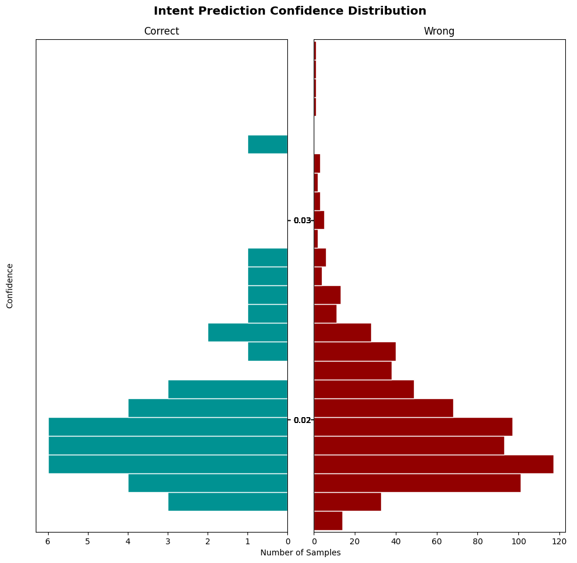

```python
# Rasa installation check (suppress output)
import warnings
warnings.filterwarnings("ignore", category=DeprecationWarning)

```


```python
# Clean output only
import os, warnings, sys, json, pathlib
warnings.filterwarnings("ignore", category=DeprecationWarning)

# Extend PATH (in case Jupyter cannot find Rasa)
os.environ["PATH"] = "/Users/jessicahong/.pyenv/versions/3.10.12/envs/nlp_env/bin:" + os.environ["PATH"]

# Log folder
os.makedirs("logs", exist_ok=True)

# Rasa readiness check (suppress all output)
!rasa --version > /dev/null 2>&1
print("✅ Rasa ready")

```

    ✅ Rasa ready


```python
# 2) Generate data (sample BANKING77 → create nlu.yml / domain.yml)
```


```python
from datasets import load_dataset
from collections import defaultdict
import yaml, random, os

DATASET = "PolyAI/banking77"
MAX_PER_INTENT = 10
```


```python
# Load BANKING77 dataset
ds = load_dataset("PolyAI/banking77", split="train")

# Initialize defaultdict: {intent: [examples]}
intent2examples = defaultdict(list)
```

    Using the latest cached version of the dataset since PolyAI/banking77 couldn't be found on the Hugging Face Hub
    Found the latest cached dataset configuration 'default' at /Users/jessicahong/.cache/huggingface/datasets/PolyAI___banking77/default/1.1.0/17ffc2ed47c2ed928bee64127ff1dbc97204cb974c2f980becae7c864007aed9 (last modified on Sat Aug 23 23:22:58 2025).


```python
print(ds)
```

    Dataset({
        features: ['text', 'label'],
        num_rows: 10003
    })


```python
print(ds.features)
```

    {'text': Value('string'), 'label': ClassLabel(names=['activate_my_card', 'age_limit', 'apple_pay_or_google_pay', 'atm_support', 'automatic_top_up', 'balance_not_updated_after_bank_transfer', 'balance_not_updated_after_cheque_or_cash_deposit', 'beneficiary_not_allowed', 'cancel_transfer', 'card_about_to_expire', 'card_acceptance', 'card_arrival', 'card_delivery_estimate', 'card_linking', 'card_not_working', 'card_payment_fee_charged', 'card_payment_not_recognised', 'card_payment_wrong_exchange_rate', 'card_swallowed', 'cash_withdrawal_charge', 'cash_withdrawal_not_recognised', 'change_pin', 'compromised_card', 'contactless_not_working', 'country_support', 'declined_card_payment', 'declined_cash_withdrawal', 'declined_transfer', 'direct_debit_payment_not_recognised', 'disposable_card_limits', 'edit_personal_details', 'exchange_charge', 'exchange_rate', 'exchange_via_app', 'extra_charge_on_statement', 'failed_transfer', 'fiat_currency_support', 'get_disposable_virtual_card', 'get_physical_card', 'getting_spare_card', 'getting_virtual_card', 'lost_or_stolen_card', 'lost_or_stolen_phone', 'order_physical_card', 'passcode_forgotten', 'pending_card_payment', 'pending_cash_withdrawal', 'pending_top_up', 'pending_transfer', 'pin_blocked', 'receiving_money', 'Refund_not_showing_up', 'request_refund', 'reverted_card_payment?', 'supported_cards_and_currencies', 'terminate_account', 'top_up_by_bank_transfer_charge', 'top_up_by_card_charge', 'top_up_by_cash_or_cheque', 'top_up_failed', 'top_up_limits', 'top_up_reverted', 'topping_up_by_card', 'transaction_charged_twice', 'transfer_fee_charged', 'transfer_into_account', 'transfer_not_received_by_recipient', 'transfer_timing', 'unable_to_verify_identity', 'verify_my_identity', 'verify_source_of_funds', 'verify_top_up', 'virtual_card_not_working', 'visa_or_mastercard', 'why_verify_identity', 'wrong_amount_of_cash_received', 'wrong_exchange_rate_for_cash_withdrawal'])}


```python
print(ds[0]) 
```

    {'text': 'I am still waiting on my card?', 'label': 11}


```python
intent2examples["balance"].append("What is my account balance?")
intent2examples["transfer"].append("Transfer money to John")
print(intent2examples)
```

    defaultdict(<class 'list'>, {'balance': ['What is my account balance?'], 'transfer': ['Transfer money to John']})


```python
# Iterate over texts and labels
for text, label_id in zip(ds["text"], ds["label"]):
    # Convert label_id (integer) into string intent name
    intent = ds.features["label"].int2str(label_id)
    # Append the text example to the list of that intent
    intent2examples[intent].append(text)
```


```python
# --- Verification / Debugging ---
print("Number of intents:", len(intent2examples))          # total intents
print("Sample keys:", list(intent2examples.keys())[:5])    # first 5 intents
print("Examples for one intent:", intent2examples["balance"][:3])  # first 3 examples of 'balance'
```

    Number of intents: 79
    Sample keys: ['balance', 'transfer', 'card_arrival', 'card_linking', 'exchange_rate']
    Examples for one intent: ['What is my account balance?']


```python
import random

# Iterate over each intent and its list of examples
for k, v in intent2examples.items():
    # Shuffle the examples randomly (to avoid bias from ordering)
    random.shuffle(v)
    # Keep only up to MAX_PER_INTENT examples per intent
    intent2examples[k] = v[:MAX_PER_INTENT]

```


```python
# --- Verification / Debugging ---
print("Number of intents:", len(intent2examples))        # total number of intents
sample_intent = list(intent2examples.keys())[0]          # pick one intent (first key)
print("Sample intent:", sample_intent)
print("Examples for this intent:", intent2examples[sample_intent][:5])  # show first 5 examples
```

    Number of intents: 79
    Sample intent: balance
    Examples for this intent: ['What is my account balance?']


```python
# Build NLU blocks for Rasa training data
# Each block has: 
#   - "intent": the intent name
#   - "examples": examples joined in Rasa NLU format ("- example text")
nlu_blocks = [
    {
        "intent": k,
        "examples": "\n".join(f"- {t}" for t in v)  # prefix each example with "- "
    }
    for k, v in sorted(intent2examples.items())     # sort intents alphabetically for consistency
]
```


```python
# --- Verification / Debugging ---
print("Number of NLU blocks:", len(nlu_blocks))
print("First block (sample):")
print(nlu_blocks[0])
```

    Number of NLU blocks: 79
    First block (sample):
    {'intent': 'Refund_not_showing_up', 'examples': "- Can you tell me why a refund I'm owed is not showing on my statement?\n- How do I find the refund on my statement?\n- It's been more than a week since I had a return charged to my card, why hasn't it showed up?\n- Hi I'm waiting for a refund for an item I bought. I have contacted the merchant directly but had nothing back. Can you tell me whether or not you are able to refund me for the item?\n- what is the status of my refund\n- My refund isn't showing up\n- When will I be able to see the refund\n- Im not sure if a seller is giving me my money back! I asked them to refund my money for the item but It's been a week now and still nothing has been given back to me. Can you resolve this for me?\n- Can you let me know where my refund money is? I requested a refund a few days back, but it's not showing up yet.  Do you guys have the money yet? Maybe it's just not in my account.  Let me know when it will become available, please.\n- I requested a refund for a large order the other day and don't think I received the funds. Can you tell me if you see them or not?"}


```python
import os, yaml

# Ensure the "data" folder exists
os.makedirs("data", exist_ok=True)

# Save NLU training data (intents + examples) into nlu.yml
with open("data/nlu.yml", "w", encoding="utf-8") as f:
    yaml.safe_dump(
        {"version": "3.1", "nlu": nlu_blocks}, 
        f, 
        sort_keys=False, 
        allow_unicode=True
    )

# Save domain file (list of intents) into domain.yml
with open("domain.yml", "w", encoding="utf-8") as f:
    yaml.safe_dump(
        {"version": "3.1", "intents": sorted(intent2examples.keys())}, 
        f, 
        sort_keys=False, 
        allow_unicode=True
    )

# Confirmation message
print(f"✅ Created data/nlu.yml & domain.yml  (intents={len(nlu_blocks)}, ~{MAX_PER_INTENT} ex/intent)")

```

    ✅ Created data/nlu.yml & domain.yml  (intents=79, ~10 ex/intent)


```python
# 3) Validate / Train / Evaluate (log to files only)
```


```python
# --- Minimal Rasa workflow (validate → train → test) ---
# All long logs are redirected to files under logs/

# 1) Validate training data
!rasa data validate > logs/validate.log 2>&1

# 2) Train NLU model
!rasa train nlu > logs/train_nlu.log 2>&1

# 3) Test NLU model
!rasa test nlu --nlu data/nlu.yml --out results_nlu > logs/test_nlu.log 2>&1

print("✅ validate/train/test completed. See logs/*.log")

```

    ✅ validate/train/test completed. See logs/*.log


```python
# --- Load & summarize Rasa NLU intent report (robust version) ---
import json
import math
import pandas as pd
from pathlib import Path

REPORT_PATH = Path("results_nlu/intent_report.json")
```


```python
# 0) Guard: file existence
if not REPORT_PATH.exists():
    raise FileNotFoundError(f"Report not found: {REPORT_PATH}. Run `rasa test nlu` first.")
```


```python
# 1) Load JSON safely
try:
    report = json.loads(REPORT_PATH.read_text(encoding="utf-8"))
except json.JSONDecodeError as e:
    raise ValueError(f"Failed to parse {REPORT_PATH}: {e}")
```


```python
# 2) Extract overall metrics with fallbacks
def _safe_round(x, n=4):
    try:
        return round(float(x), n)
    except Exception:
        return float("nan")
```


```python
acc  = _safe_round(report.get("accuracy", 0.0))
m_f1 = _safe_round(report.get("macro avg", {}).get("f1-score", 0.0))
w_f1 = _safe_round(report.get("weighted avg", {}).get("f1-score", 0.0))

print("accuracy :", acc)
print("macro_f1 :", m_f1)
print("weighted_f1:", w_f1)
```

    accuracy : 0.0519
    macro_f1 : 0.0363
    weighted_f1: 0.0372


```python
# 3) Per-intent table (filter only intent rows)
rows = []
for k, v in report.items():
    if isinstance(v, dict) and {"precision", "recall", "f1-score"} <= set(v.keys()):
        rows.append({
            "intent":   k,
            "precision": v.get("precision", float("nan")),
            "recall":    v.get("recall", float("nan")),
            "f1":        v.get("f1-score", float("nan")),
            "support":   v.get("support", 0),
        })

df = pd.DataFrame(rows)
```


```python
# Ensure numeric dtypes (in case strings came through)
for col in ["precision", "recall", "f1", "support"]:
    df[col] = pd.to_numeric(df[col], errors="coerce")
```


```python
# 4) Sort & pick top/bottom (handle small # of intents gracefully)
k = min(5, max(0, len(df)))
df_top = df.sort_values(["f1", "support"], ascending=[False, False]).head(k).reset_index(drop=True)
df_bot = df.sort_values(["f1", "support"], ascending=[True,  True]).head(k).reset_index(drop=True)

print("\nTop-5 intents by F1")
try:
    from IPython.display import display
    display(df_top)
except Exception:
    print(df_top.to_string(index=False))

print("Bottom-5 intents by F1")
try:
    display(df_bot)
except Exception:
    print(df_bot.to_string(index=False))

```

    
    Top-5 intents by F1


<div>
<style scoped>
    .dataframe tbody tr th:only-of-type {
        vertical-align: middle;
    }

    .dataframe tbody tr th {
        vertical-align: top;
    }

    .dataframe thead th {
        text-align: right;
    }
</style>
<table border="1" class="dataframe">
  <thead>
    <tr style="text-align: right;">
      <th></th>
      <th>intent</th>
      <th>precision</th>
      <th>recall</th>
      <th>f1</th>
      <th>support</th>
    </tr>
  </thead>
  <tbody>
    <tr>
      <th>0</th>
      <td>cash_withdrawal_not_recognised</td>
      <td>1.000000</td>
      <td>0.1</td>
      <td>0.181818</td>
      <td>10</td>
    </tr>
    <tr>
      <th>1</th>
      <td>top_up_by_card_charge</td>
      <td>1.000000</td>
      <td>0.1</td>
      <td>0.181818</td>
      <td>10</td>
    </tr>
    <tr>
      <th>2</th>
      <td>beneficiary_not_allowed</td>
      <td>0.153846</td>
      <td>0.2</td>
      <td>0.173913</td>
      <td>10</td>
    </tr>
    <tr>
      <th>3</th>
      <td>transfer_not_received_by_recipient</td>
      <td>0.500000</td>
      <td>0.1</td>
      <td>0.166667</td>
      <td>10</td>
    </tr>
    <tr>
      <th>4</th>
      <td>transfer_fee_charged</td>
      <td>0.500000</td>
      <td>0.1</td>
      <td>0.166667</td>
      <td>10</td>
    </tr>
  </tbody>
</table>
</div>


    Bottom-5 intents by F1


<div>
<style scoped>
    .dataframe tbody tr th:only-of-type {
        vertical-align: middle;
    }

    .dataframe tbody tr th {
        vertical-align: top;
    }

    .dataframe thead th {
        text-align: right;
    }
</style>
<table border="1" class="dataframe">
  <thead>
    <tr style="text-align: right;">
      <th></th>
      <th>intent</th>
      <th>precision</th>
      <th>recall</th>
      <th>f1</th>
      <th>support</th>
    </tr>
  </thead>
  <tbody>
    <tr>
      <th>0</th>
      <td>transfer</td>
      <td>0.0</td>
      <td>0.0</td>
      <td>0.0</td>
      <td>1</td>
    </tr>
    <tr>
      <th>1</th>
      <td>balance</td>
      <td>0.0</td>
      <td>0.0</td>
      <td>0.0</td>
      <td>1</td>
    </tr>
    <tr>
      <th>2</th>
      <td>card_not_working</td>
      <td>0.0</td>
      <td>0.0</td>
      <td>0.0</td>
      <td>9</td>
    </tr>
    <tr>
      <th>3</th>
      <td>verify_my_identity</td>
      <td>0.0</td>
      <td>0.0</td>
      <td>0.0</td>
      <td>10</td>
    </tr>
    <tr>
      <th>4</th>
      <td>direct_debit_payment_not_recognised</td>
      <td>0.0</td>
      <td>0.0</td>
      <td>0.0</td>
      <td>10</td>
    </tr>
  </tbody>
</table>
</div>


```python
# 5) Save artifacts (optional but handy for Git/GitHub)
out_dir = Path("results_nlu")
out_dir.mkdir(parents=True, exist_ok=True)
df.to_csv(out_dir / "intent_report_flat.csv", index=False)
df_top.to_csv(out_dir / "intent_top5.csv", index=False)
df_bot.to_csv(out_dir / "intent_bottom5.csv", index=False)
print("📝 Saved:", out_dir / "intent_report_flat.csv", ",", out_dir / "intent_top5.csv", ",", out_dir / "intent_bottom5.csv")
```

    📝 Saved: results_nlu/intent_report_flat.csv , results_nlu/intent_top5.csv , results_nlu/intent_bottom5.csv


```python
# --- Visualize Rasa evaluation plots ---
from IPython.display import Image, display

# 1) Confusion matrix (intent-level classification)
display(Image(filename="results_nlu/intent_confusion_matrix.png"))

# 2) Histogram of intent distribution
display(Image(filename="results_nlu/intent_histogram.png"))

```


    

    


    

    


```python

```


```python
#5) 혼동행렬/히스토그램 (이미지 두 장만 표시)
```


```python
from IPython.display import Image, display
display(Image(filename="results_nlu/intent_confusion_matrix.png"))
display(Image(filename="results_nlu/intent_histogram.png"))
```


    

    


    

    


```python

```
