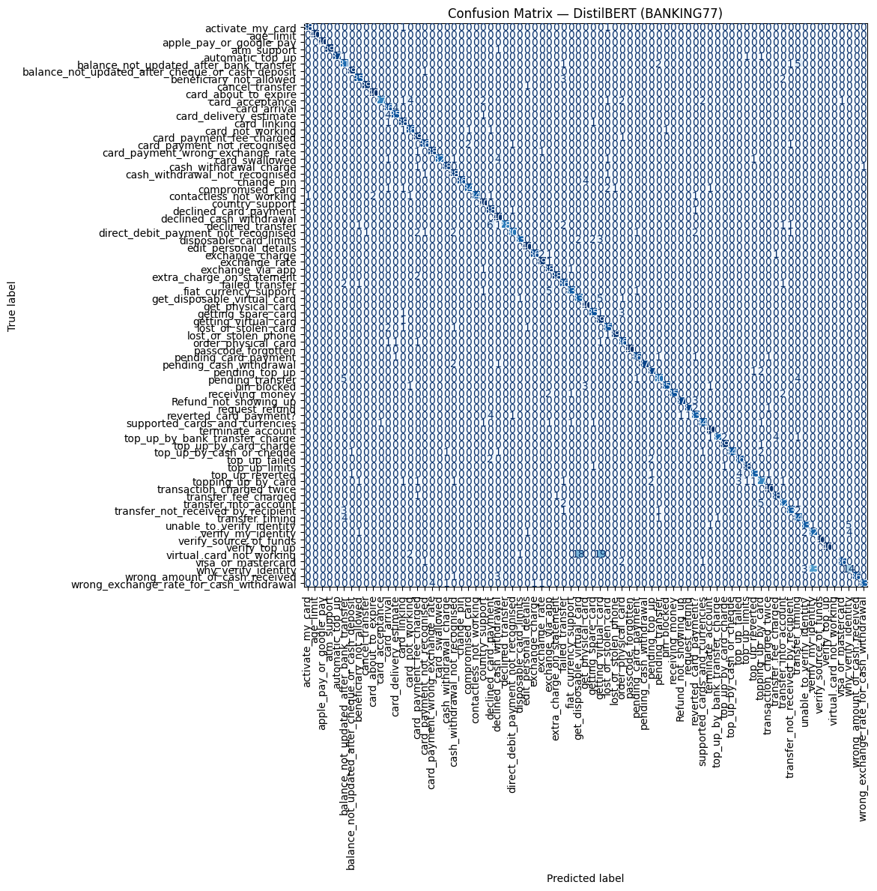

```python
"""
Load dataset (BANKING77)
Tokenize with DistilBERT tokenizer
Define model (AutoModelForSequenceClassification)
Training with Trainer API
Evaluate (accuracy, f1)
Save results (confusion matrix, CSV)
"""
```


    '\nLoad dataset (BANKING77)\nTokenize with DistilBERT tokenizer\nDefine model (AutoModelForSequenceClassification)\nTraining with Trainer API\nEvaluate (accuracy, f1)\nSave results (confusion matrix, CSV)\n'


```python
import os
import matplotlib.pyplot as plt

# STEP X: Setup save directory
# All experiment outputs (plots, CSV, models, etc.) will be stored here.
save_dir = "09_Mini_Project/Intent_Classification/results"
os.makedirs(save_dir, exist_ok=True)   # Create folder if it does not exist

# STEP X: Save plot (e.g., confusion matrix for DistilBERT on BANKING77)
save_path = os.path.join(save_dir, "cm_distilbert_banking77.png")
plt.savefig(save_path, dpi=140)        # Save figure as PNG with good resolution
plt.show()                             # Display the plot in notebook

print("Saved confusion matrix to:", save_path)
```


    <Figure size 640x480 with 0 Axes>


    Saved confusion matrix to: 09_Mini_Project/Intent_Classification/results/cm_distilbert_banking77.png


```python
#Data + Metrics
```


```python
# STEP 1: Import required libraries
from datasets import load_dataset      # to load the BANKING77 dataset
import numpy as np                     # numerical operations
import evaluate                        # Hugging Face evaluation metrics
```


```python
# STEP 2: Load dataset (BANKING77)
# The dataset already provides 'train' and 'test' splits
ds = load_dataset("PolyAI/banking77")

# Quick check of the splits
print(ds)
```

    DatasetDict({
        train: Dataset({
            features: ['text', 'label'],
            num_rows: 10003
        })
        test: Dataset({
            features: ['text', 'label'],
            num_rows: 3080
        })
    })


```python
# STEP 3: Load evaluation metrics
acc = evaluate.load("accuracy")
f1  = evaluate.load("f1")
```


```python
# compute_metrics => Takes the model's predictions (logits) and the ground-truth labels, 
# then returns quantitative performance metrics (Accuracy, F1) as a dictionary.
```


```python
def compute_metrics(eval_pred):
    # Unpack predictions (logits) and true labels
    logits, labels = eval_pred
    
    # Convert logits to predicted class indices
    preds = np.argmax(logits, axis=1)

    # Compute accuracy and macro-F1 using Hugging Face evaluate
    acc_result = acc.compute(predictions=preds, references=labels)
    f1_result  = f1.compute(predictions=preds, references=labels, average="macro")

    # Return metrics as a dictionary (Trainer expects this format)
    return {
        "accuracy": acc_result["accuracy"],
        "f1_macro": f1_result["f1"],
    }
```


```python
#DistilBERTmax_len=64
```


```python
from transformers import AutoTokenizer
```


```python
# STEP 4: Tokenizer setup
model_name = "distilbert-base-uncased"   # pretrained DistilBERT
num_labels = 77                          # BANKING77 has 77 intent classes
max_len    = 64                          # max sequence length
```


```python
# Load DistilBERT tokenizer
tok = AutoTokenizer.from_pretrained(model_name)
```


```python
# STEP 5: Tokenize the dataset
def tok_fn(batch):
    # Convert text into input IDs and attention masks
    return tok(
        batch["text"],
        truncation=True,            # cut off sequences longer than max_length
        padding="max_length",       # pad all sequences to the same length
        max_length=max_len          # maximum sequence length
    )
```


```python
# Apply tokenizer to dataset
ds_tok = ds.map(tok_fn, batched=True)
```


    Map:   0%|          | 0/3080 [00:00<?, ? examples/s]


```python
# Rename 'label' → 'labels' (Trainer expects the column to be named 'labels')
ds_tok = ds_tok.rename_column("label", "labels")
```


```python
# Set dataset format to PyTorch tensors
ds_tok.set_format(type="torch", columns=["input_ids", "attention_mask", "labels"])
```


```python
#Model Training(1 epoch / batch 8)
```


```python
from transformers import (
    AutoModelForSequenceClassification, TrainingArguments, Trainer,
    DataCollatorWithPadding
)
from transformers.trainer_utils import IntervalStrategy
```


```python
# 1) validation split(train의 10%를 val로)
split = ds_tok["train"].train_test_split(test_size=0.1, seed=42)
train_ds = split["train"]
val_ds   = split["test"]    
```


```python
model = AutoModelForSequenceClassification.from_pretrained(
    model_name, num_labels=num_labels
)
```

    Some weights of DistilBertForSequenceClassification were not initialized from the model checkpoint at distilbert-base-uncased and are newly initialized: ['classifier.bias', 'classifier.weight', 'pre_classifier.bias', 'pre_classifier.weight']
    You should probably TRAIN this model on a down-stream task to be able to use it for predictions and inference.


```python
# 3) Dynamic padding
collator = DataCollatorWithPadding(tokenizer=tok)
```


```python
args = TrainingArguments(
    output_dir="./out_distilbert",      # Directory to save training outputs (checkpoints, logs, etc.)
    learning_rate=2e-5,                 # Typical learning rate for BERT models (AdamW optimizer)
    num_train_epochs=3,                 # Number of times to iterate over the entire dataset
    per_device_train_batch_size=8,      # Training batch size (smaller for MacBook M2 memory)
    per_device_eval_batch_size=16,      # Evaluation batch size (can be larger due to no backprop)
    
    eval_strategy=IntervalStrategy.EPOCH,  # Evaluate at the end of each epoch (use eval_strategy in older versions)
    save_strategy=IntervalStrategy.EPOCH,  # Save a checkpoint at the end of each epoch
    
    weight_decay=0.01,                  # AdamW weight decay for regularization (default for BERT)
    warmup_ratio=0.1,                   # Warmup for 10% of training steps before reaching full LR
    load_best_model_at_end=True,        # Load the best model at the end of training
    metric_for_best_model="f1_macro",   # Use macro-F1 as the metric to select the best model
    greater_is_better=True,             # Higher F1 score means better
    
    report_to=None,                     # Disable external loggers (e.g., W&B, TensorBoard)
    dataloader_pin_memory=False,        # Disable pin_memory for MPS (avoids warnings)
    seed=42,                            # Random seed for reproducibility
)
```


```python
# 5) Trainer
trainer = Trainer(
    model=model,            # DistilBERT classification model we created
    args=args,              # TrainingArguments (training configuration)
    train_dataset=train_ds, # Training dataset (train split)
    eval_dataset=val_ds,    # Validation dataset (validation split)
    tokenizer=tok,          # Tokenizer (used by Trainer for batch preparation)
    data_collator=collator, # DataCollatorWithPadding (ensures dynamic padding of sequences)
    compute_metrics=compute_metrics  # Evaluation function (returns accuracy and F1)
)
```

    /var/folders/6y/xtl4b0cx1cs9zrr9n5y814_h0000gn/T/ipykernel_12369/2516955857.py:2: FutureWarning: `tokenizer` is deprecated and will be removed in version 5.0.0 for `Trainer.__init__`. Use `processing_class` instead.
      trainer = Trainer(


```python
trainer.train()             
metrics = trainer.evaluate() # validation 
print(metrics)
```


    <div>

      <progress value='3378' max='3378' style='width:300px; height:20px; vertical-align: middle;'></progress>
      [3378/3378 04:43, Epoch 3/3]
    </div>
    <table border="1" class="dataframe">
  <thead>
 <tr style="text-align: left;">
      <th>Epoch</th>
      <th>Training Loss</th>
      <th>Validation Loss</th>
      <th>Accuracy</th>
      <th>F1 Macro</th>
    </tr>
  </thead>
  <tbody>
    <tr>
      <td>1</td>
      <td>2.497300</td>
      <td>1.529754</td>
      <td>0.744256</td>
      <td>0.685000</td>
    </tr>
    <tr>
      <td>2</td>
      <td>0.970600</td>
      <td>0.664639</td>
      <td>0.865135</td>
      <td>0.850103</td>
    </tr>
    <tr>
      <td>3</td>
      <td>0.530700</td>
      <td>0.518848</td>
      <td>0.887113</td>
      <td>0.876599</td>
    </tr>
  </tbody>
</table><p>


    {'eval_loss': 0.5188480019569397, 'eval_accuracy': 0.8871128871128872, 'eval_f1_macro': 0.8765994412565649, 'eval_runtime': 2.2752, 'eval_samples_per_second': 439.96, 'eval_steps_per_second': 27.69, 'epoch': 3.0}


```python
# 5) Quick sanity-check inference (did the model actually learn?)
from transformers import pipeline
```


```python
# Evaluate on validation (trainer의 eval_dataset) & test
distil_val  = trainer.evaluate()                   # validation metrics
distil_test = trainer.evaluate(ds_tok["test"])     # test metrics
```


```python
# Simple inference with the fine-tuned model
clf = pipeline(
    "text-classification",
    model=trainer.model,
    tokenizer=tok,
    return_all_scores=False   # Return only the top-1 prediction
    # Device is omitted: the model is already placed on MPS/CPU by the trainer
)
```

    Device set to use mps:0
    /Users/jessicahong/.pyenv/versions/3.11.11/lib/python3.11/site-packages/transformers/pipelines/text_classification.py:111: UserWarning: `return_all_scores` is now deprecated,  if want a similar functionality use `top_k=None` instead of `return_all_scores=True` or `top_k=1` instead of `return_all_scores=False`.
      warnings.warn(


```python
examples = [
    "I lost my card. Can you block it?",
    "What's my current account balance?",
    "How do I change my PIN?",
]
for t in examples:
    print(t, "->", clf(t)[0])   # Prints the top-1 predicted label and its score

```

    I lost my card. Can you block it? -> {'label': 'LABEL_13', 'score': 0.19281639158725739}
    What's my current account balance? -> {'label': 'LABEL_5', 'score': 0.6128121018409729}
    How do I change my PIN? -> {'label': 'LABEL_21', 'score': 0.8843547701835632}


```python
# 6) Save artifacts (good for GitHub)
out_dir = "./out_distilbert"
best_dir = f"{out_dir}/best_model"
os.makedirs(out_dir, exist_ok=True)
```


```python
print("Output directory:", out_dir)
print("Best model directory:", best_dir)
print("Contents of out_dir before saving:", os.listdir(out_dir) if os.path.exists(out_dir) else "Directory not found")
```

    Output directory: ./out_distilbert
    Best model directory: ./out_distilbert/best_model
    Contents of out_dir before saving: ['metrics.json', 'checkpoint-1126', 'best_model', 'checkpoint-1251', 'checkpoint-2252', 'checkpoint-3378', 'runs']


```python
# Save best model & tokenizer
trainer.model.save_pretrained(best_dir)
tok.save_pretrained(best_dir)
print("Saved model & tokenizer to:", best_dir)
```

    Saved model & tokenizer to: ./out_distilbert/best_model


```python
# Save a lightweight metrics summary (validation + test)
import json
summary = {
    "val_accuracy":  distil_val.get("eval_accuracy", None),
    "val_f1_macro":  distil_val.get("eval_f1_macro", None),
    "test_accuracy": distil_test.get("eval_accuracy", None),
    "test_f1_macro": distil_test.get("eval_f1_macro", None),
}

with open(f"{out_dir}/metrics.json", "w") as f:
    json.dump(summary, f, indent=2)
```


```python
import os
import numpy as np
import matplotlib.pyplot as plt
from sklearn.metrics import confusion_matrix, ConfusionMatrixDisplay

%matplotlib inline
```


```python
# 1) Predict on test set
trainer.model.eval()  # (optional) make sure we're in eval mode
pred_out = trainer.predict(ds_tok["test"])
y_pred = np.argmax(pred_out.predictions, axis=1)
y_true = np.array(ds_tok["test"]["labels"])
```


```python
# 2) Confusion matrix
cm = confusion_matrix(y_true, y_pred)
```


```python
# 3) Pretty plot with intent names
label_names = ds["train"].features["label"].names  # human-readable labels
disp = ConfusionMatrixDisplay(confusion_matrix=cm, display_labels=label_names)

fig, ax = plt.subplots(figsize=(12, 12))
disp.plot(ax=ax, xticks_rotation=90, cmap="Blues", values_format="d", colorbar=False)
ax.set_title("Confusion Matrix — DistilBERT (BANKING77)")
plt.tight_layout()
```


    

    


```python
# 4) Save into the project results folder
save_dir = "09_Mini_Project/Intent_Classification/results"
os.makedirs(save_dir, exist_ok=True)
save_path = os.path.join(save_dir, "cm_distilbert_banking77.png")
plt.savefig(save_path, dpi=160)
plt.show()
print("Saved to:", save_path)
```


    <Figure size 640x480 with 0 Axes>


    Saved to: 09_Mini_Project/Intent_Classification/results/cm_distilbert_banking77.png


```python

```
