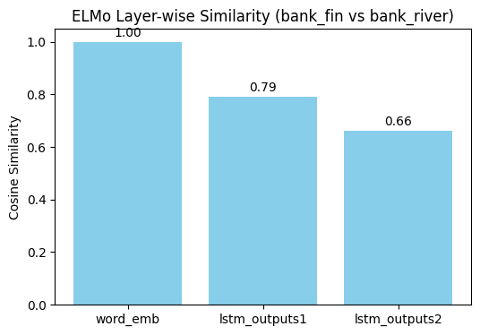
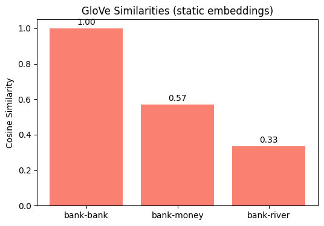

# ELMo vs GloVe — Polysemy Demo (word: “bank”)

This folder contains a minimal, reproducible demo that contrasts **contextual embeddings (ELMo)** with **static embeddings (GloVe)** using the polysemous word **“bank”** (finance vs river contexts).

## Files
- `elmo_vs_glove_polysemy.md` — walkthrough with code and explanations
- `output_18_0.png` — visualization (ELMo layer-wise cosine similarity)
- `output_18_1.png` — visualization (GloVe baseline similarities)

## Key Idea
- **Static (GloVe):** one vector per word → cannot separate senses  
- **Contextual (ELMo):** vectors change with context → senses diverge

## Example Results (your run)
- **ELMo (cosine: bank_fin ↔ bank_river)**
  - `word_emb` = **1.0000** (static-like layer)
  - `lstm_outputs1` ≈ **0.7928**
  - `lstm_outputs2` ≈ **0.6618** (more semantic separation)
- **GloVe**
  - `cos(bank, bank)` = **1.0000**
  - `cos(bank, money)` ≈ **0.5718**
  - `cos(bank, river)` ≈ **0.3345**

These numbers show that ELMo’s upper LSTM layer better separates the two senses of *bank*, while GloVe always returns the same vector.

## Visualizations
ELMo (layer-wise)  


GloVe (static baseline)  


## Reproduce (quick notes)
- Python 3.10+, TensorFlow 2.x, TensorFlow Hub, gensim
- Install:
  ```bash
  pip install tensorflow tensorflow-hub gensim

