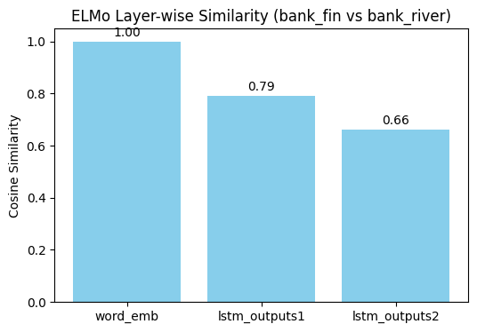

```python
#ELMo vs GloVe (polysemy demo: “bank”) – comparing contextual vs static embeddings
```


```python
"""
# ELMo Polysemy Demo: "bank" in finance vs river contexts
- Step 1: Environment check
- Step 2: Load ELMo (tokens signature)
- Step 3: Compare bank_fin vs bank_river
- Step 4: Layer-wise similarity (word_emb, lstm1, lstm2)
- Step 5: Static embedding (GloVe) baseline
"""
```


    '\n# ELMo Polysemy Demo: "bank" in finance vs river contexts\n- Step 1: Environment check\n- Step 2: Load ELMo (tokens signature)\n- Step 3: Compare bank_fin vs bank_river\n- Step 4: Layer-wise similarity (word_emb, lstm1, lstm2)\n- Step 5: Static embedding (GloVe) baseline\n'


```python
# --- Step 1: Environment Check ---
```


```python
import sys, tensorflow as tf, tensorflow_hub as hub
print("PY:", sys.executable)  # .../envs/elmo310/bin/python 이어야 함
print("TF:", tf.__version__)  # 2.12.0
elmo = hub.load("https://tfhub.dev/google/elmo/3")
out = elmo.signatures['default'](tf.constant(["Hello ELMo"]))
print("ELMo OK:", out['elmo'].shape)
```

    PY: /Users/jessicahong/.pyenv/versions/3.11.11/bin/python
    TF: 2.12.0
    ELMo OK: (1, 2, 1024)


```python
import sys, tensorflow as tf
print(sys.executable)   # .../envs/elmo310/bin/python  이어야 OK
print(tf.__version__)   # 2.12.0
```

    /Users/jessicahong/.pyenv/versions/3.11.11/bin/python
    2.12.0


```python
import tensorflow as tf, numpy as np, tensorflow_hub as hub
import string
```


```python
# --- Step 1: Load ELMo from TF-Hub (downloaded once and cached) ---
elmo = hub.load("https://tfhub.dev/google/elmo/3")
sig = elmo.signatures["tokens"]  # use 'tokens' signature
```


```python
def simple_tokens(s):
    """
    Very simple whitespace-based tokenizer that also strips punctuation.
    Note:
        - This is NOT identical to ELMo's internal tokenization.
        - But since we manually feed the token sequence to the model (tokens signature),
          the indexing will now be under our control.
    Args:
        s (str): Input sentence.
    Returns:
        List[str]: A list of tokens with punctuation removed.
    """
    return [w.strip(string.punctuation) for w in s.split() if w.strip(string.punctuation)]

```


```python
# --- Quick check ---
sents = [
    "I enjoy learning NLP.",
]

for s in sents:
    print("Input :", s)
    print("Tokens:", simple_tokens(s))
    print()
```

    Input : I enjoy learning NLP.
    Tokens: ['I', 'enjoy', 'learning', 'NLP']
    


```python
import tensorflow as tf

def pad_to_max(batch_tokens):
    """
    Pad a batch of tokenized sentences to the same length.
    Args:
        batch_tokens (List[List[str]]): A batch of tokenized sentences.
    Returns:
        tokens (tf.Tensor, shape=[B, T]): Padded string tensor.
        lengths (tf.Tensor, shape=[B]): Original lengths of each sequence.
    Notes:
        - Padding is done with the empty string "".
        - This ensures all sentences in the batch have equal length (maxlen).
    """
    maxlen = max(len(t) for t in batch_tokens)
    padded = [t + [""] * (maxlen - len(t)) for t in batch_tokens]  # pad with ""
    lens   = [len(t) for t in batch_tokens]
    return tf.constant(padded, dtype=tf.string), tf.constant(lens, dtype=tf.int32)

```


```python
# --- Quick check with different lengths ---
batch_tokens = [
    ['I', 'love', 'NLP'],  # length 3
    ['Deep', 'learning', 'is', 'very', 'powerful']  # length 5
]

tokens, lengths = pad_to_max(batch_tokens)

print("Padded tokens:\n", tokens.numpy())
print("Sequence lengths:", lengths.numpy())


```

    Padded tokens:
     [[b'I' b'love' b'NLP' b'' b'']
     [b'Deep' b'learning' b'is' b'very' b'powerful']]
    Sequence lengths: [3 5]


```python
# Sample sentences
sents = [
    "I went to the bank to deposit money.",
    "The river overflowed the bank after heavy rain."
]

# Step 1: Tokenize each sentence using our simple tokenizer
tok_lists = [simple_tokens(s) for s in sents]

# Step 2: Pad token lists to the same length and get their lengths
tokens, seq_len = pad_to_max(tok_lists)
```


```python
# --- Quick check ---
print("Original token lists:")
for i, toks in enumerate(tok_lists):
    print(f"Sentence {i+1}: {toks}")

print("\nPadded tokens tensor:")
print(tokens.numpy())   # 2D array: shape [batch_size, max_seq_len]

print("\nSequence lengths:")
print(seq_len.numpy())  # Original lengths before padding
```

    Original token lists:
    Sentence 1: ['I', 'went', 'to', 'the', 'bank', 'to', 'deposit', 'money']
    Sentence 2: ['The', 'river', 'overflowed', 'the', 'bank', 'after', 'heavy', 'rain']
    
    Padded tokens tensor:
    [[b'I' b'went' b'to' b'the' b'bank' b'to' b'deposit' b'money']
     [b'The' b'river' b'overflowed' b'the' b'bank' b'after' b'heavy' b'rain']]
    
    Sequence lengths:
    [8 8]


```python
# Run ELMo tokens signature
out = sig(tokens=tokens, sequence_len=seq_len)
# Available keys: 'elmo' (1024), 'lstm_outputs1' (1024), 'lstm_outputs2' (1024), 'word_emb' (512)

embs = out["lstm_outputs2"]  # (B, T, 1024) → 상위 LSTM층: 의미 정보 선호
embs = embs.numpy()
```


```python
# --- Step 3: Vectorization and Similarity Check ---
def token_vec(batch_idx, token_str):
    """
    Fetch the contextualized embedding vector for a given token.
    Args:
        batch_idx (int): Index of the sentence in the batch.
        token_str (str): The target token (case-insensitive).
    Returns:
        np.ndarray: Vector of shape (1024,) representing the token embedding.
    Note:
        - Token index is found from our padded token list (tok_lists).
        - If token_str is not found, this will raise a ValueError.
    """
    seq = [t.lower() for t in tok_lists[batch_idx]]
    idx = seq.index(token_str.lower())  # exact index in our padded token sequence
    return embs[batch_idx, idx]
    
def cos(a, b):
    """
    Compute cosine similarity between two vectors.
    Returns a value between -1.0 and 1.0.
    """
    na, nb = np.linalg.norm(a), np.linalg.norm(b)
    if na == 0 or nb == 0:
        return 0.0
    return float(np.dot(a, b) / (na * nb))

```


```python
# Extract contextual embeddings
v_bank_fin   = token_vec(0, "bank")   # "bank" in finance sentence
v_bank_river = token_vec(1, "bank")   # "bank" in river sentence
v_money      = token_vec(0, "money")  # "money" token
v_river      = token_vec(1, "river")  # "river" token

```


```python
# Print cosine similarities
print("[ELMo-l2] cos(bank_fin, bank_river) =", round(cos(v_bank_fin, v_bank_river), 4))
print("[ELMo-l2] cos(bank_fin, money)      =", round(cos(v_bank_fin, v_money), 4))
print("[ELMo-l2] cos(bank_river, river)    =", round(cos(v_bank_river, v_river), 4))
```

    [ELMo-l2] cos(bank_fin, bank_river) = 0.6618
    [ELMo-l2] cos(bank_fin, money)      = 0.4522
    [ELMo-l2] cos(bank_river, river)    = 0.458


```python
# --- Step 4: Layer-wise Comparison (robust, single-source-of-truth) ---

# 0) Define sentences and build tokens consistently
sents = [
    "I went to the bank to deposit money.",
    "The river overflowed the bank after heavy rain."
]
tok_lists = [simple_tokens(s) for s in sents]               # our tokenizer
tokens, seq_len = pad_to_max(tok_lists)                     # pad + lengths

# 1) Run ELMo 'tokens' signature on the SAME tokens/lengths
sig = elmo.signatures["tokens"]
out = sig(tokens=tokens, sequence_len=seq_len)

# 2) Collect layers (B, T, D). Make sure to .numpy() now so we freeze the view
layers = {
    "word_emb":      out["word_emb"].numpy(),
    "lstm_outputs1": out["lstm_outputs1"].numpy(),
    "lstm_outputs2": out["lstm_outputs2"].numpy(),
}

# 3) Safe index lookup from the SAME tok_lists (lowercased)
def find_idx(batch, token):
    seq = [t.lower() for t in tok_lists[batch]]
    token = token.lower()
    if token not in seq:
        raise ValueError(f"Token '{token}' not found in sentence {batch}: {seq}")
    idx = seq.index(token)
    # safety: ensure idx < actual (unpadded) length
    if idx >= int(seq_len[batch].numpy()):
        raise IndexError(f"Index {idx} >= seq_len[{batch}]={int(seq_len[batch].numpy())}")
    return idx

idx_fin   = find_idx(0, "bank")   # "bank" in the finance sentence
idx_river = find_idx(1, "bank")   # "bank" in the river sentence

# 4) Cosine helper
import numpy as np
def cos(a, b, eps=1e-9):
    na, nb = np.linalg.norm(a), np.linalg.norm(b)
    return float(np.dot(a, b) / max(na * nb, eps))

# 5) Print similarities per layer
for name, L in layers.items():  # L: (B, T, D)
    v_fin   = L[0, idx_fin]
    v_river = L[1, idx_river]
    print(f"[{name}] cos(bank_fin, bank_river) = {cos(v_fin, v_river):.4f}")

```

    [word_emb] cos(bank_fin, bank_river) = 1.0000
    [lstm_outputs1] cos(bank_fin, bank_river) = 0.7928
    [lstm_outputs2] cos(bank_fin, bank_river) = 0.6618


```python
import matplotlib.pyplot as plt

# Cosine similarity results
elmo_scores = {
    "word_emb": 1.0000,
    "lstm_outputs1": 0.7928,
    "lstm_outputs2": 0.6618
}
glove_scores = {
    "bank-bank": 1.0,
    "bank-money": 0.5718,
    "bank-river": 0.3345
}

# --- Plot 1: ELMo layer-wise similarity (bank_fin vs bank_river) ---
plt.figure(figsize=(6,4))
plt.bar(elmo_scores.keys(), elmo_scores.values(), color="skyblue")
plt.title("ELMo Layer-wise Similarity (bank_fin vs bank_river)")
plt.ylabel("Cosine Similarity")
plt.ylim(0,1.05)
for k,v in elmo_scores.items():
    plt.text(k, v+0.02, f"{v:.2f}", ha="center")
plt.show()

# --- Plot 2: GloVe static similarities ---
plt.figure(figsize=(6,4))
plt.bar(glove_scores.keys(), glove_scores.values(), color="salmon")
plt.title("GloVe Similarities (static embeddings)")
plt.ylabel("Cosine Similarity")
plt.ylim(0,1.05)
for k,v in glove_scores.items():
    plt.text(k, v+0.02, f"{v:.2f}", ha="center")
plt.show()

```


    

    


    

    


```python

```
